## EFS Creation Step by Step Instruction

**1.Create security group that allows NFS traffic within VPC** 

1)From AWS Console, open EC2 either through Find Services or Resently visited services.

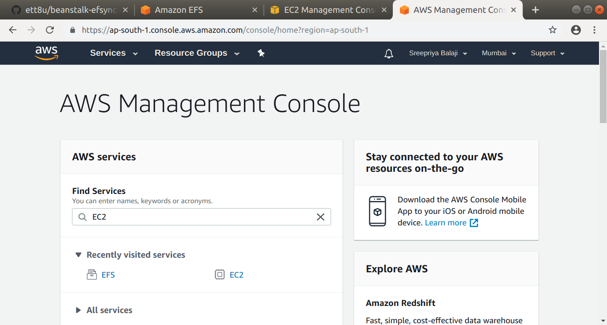

2)In the EC2 Management console Dashboard, Scroll down the side panel to reach Network and Security. Under that Select Security Groups.

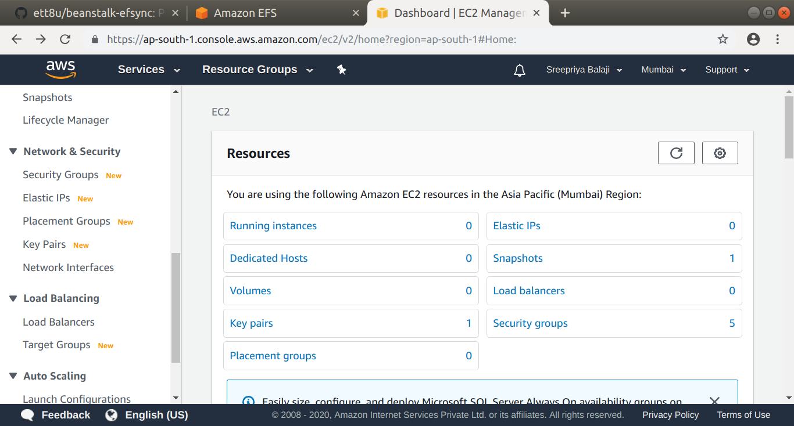

3) Click on Create security group.

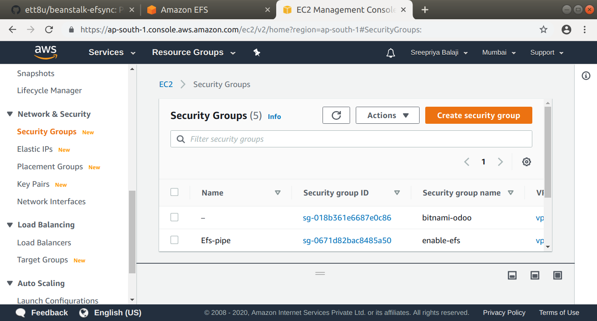

4) Enter a name and a suitable description for the group

Scroll down to the "Inbound rules" section

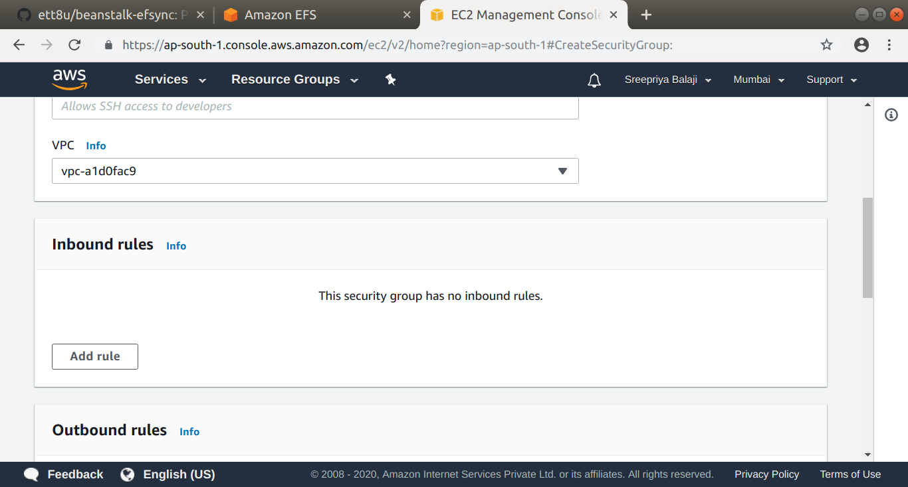

Click on "Add rule"

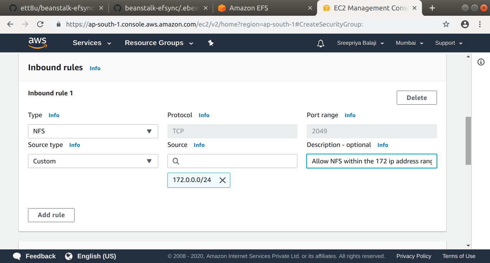

In the Inbound rule1 that gets added, select "NFS" from the dropdown for the "Type" field and "172.0.0.0/24" for the Source field. 

Scroll down further and click on "Create security group"

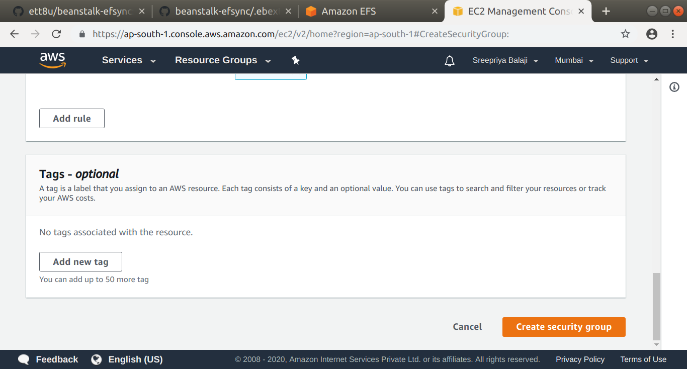

You will get the message "Security Group was created successfully"

**2. Create EFS volume via AWS console.**

1)Sign into your AWS Console. Select EFS from Find Services dropdown or 
Recently visited services.

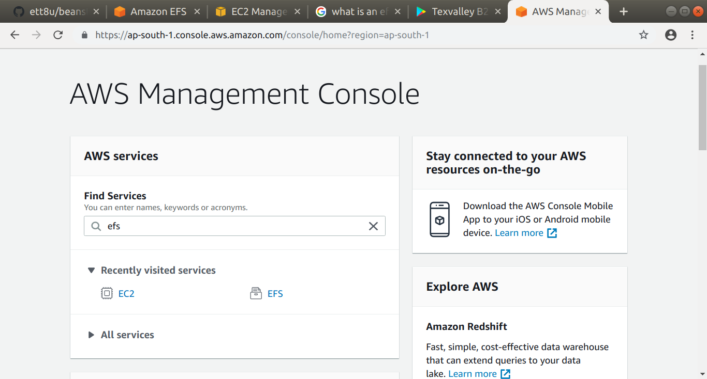

You will see a console like below... 

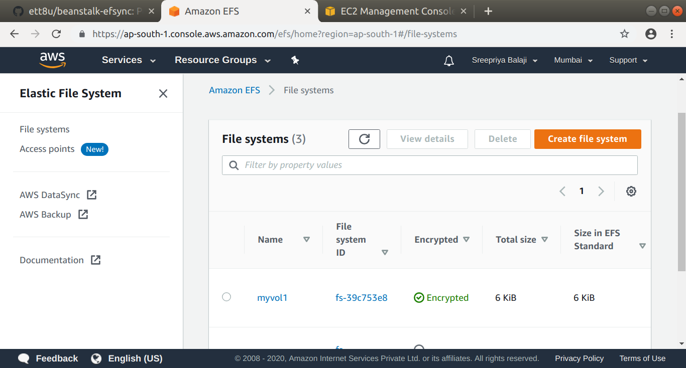

2)Click " Create file system " button.
In the Create file system dialog, enter a name for your efs volume and click
"Create"

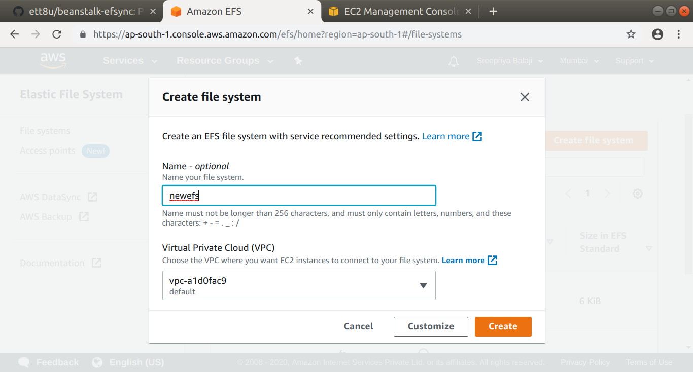
 
You can see your new efs in the File Systems list

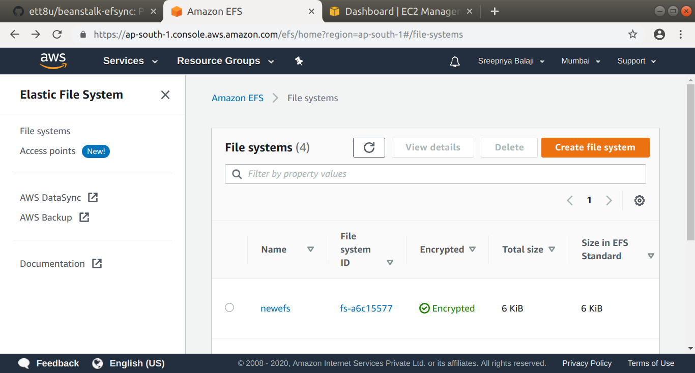

**3. Use the above security group to the created volume's network configuration.**

1)Click on the name of your newly created File System.

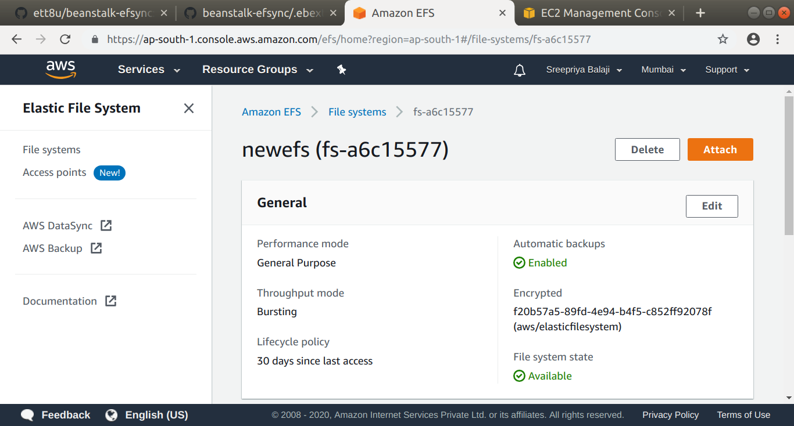

2)Scroll down after the General section, you will see a "Network" tab.

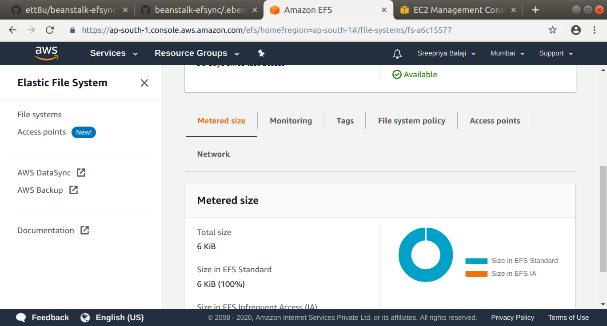

3)Select the "Network" tab

4)Click on "Manage"

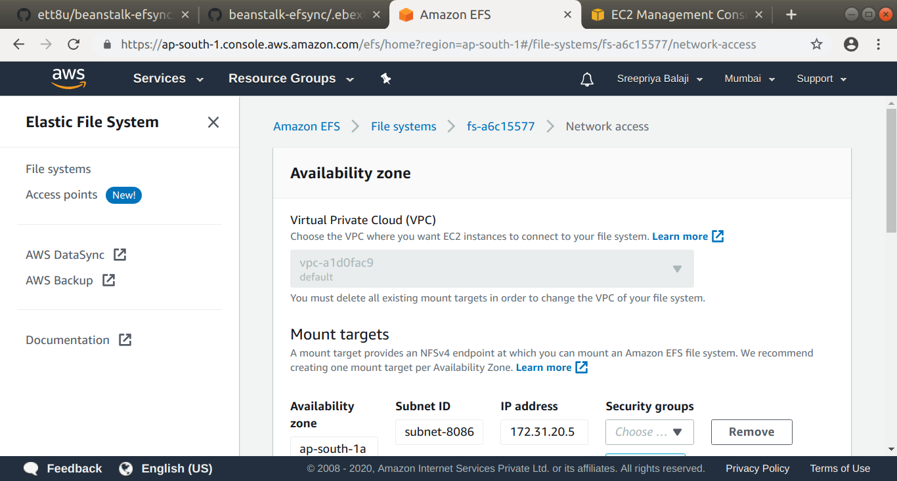

If you scroll down you will see all the Availability Zones listed in the "Mount Targets" section.

5)In each availability zone select and add the security group that you created in Step1.

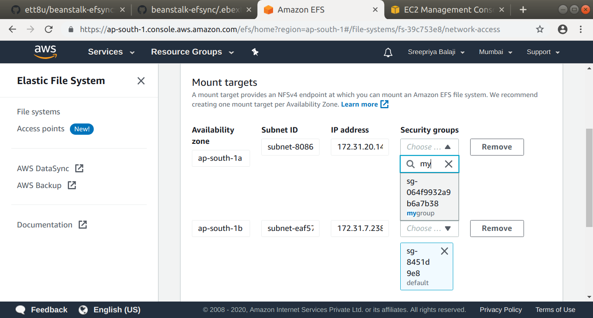

Click on Save and save the changes you have made.

**4. Set the EFS volume's FS id  as FILE_SYSTEM_ID param in 00env_param_init.config available under the folder .ebextensions.**

